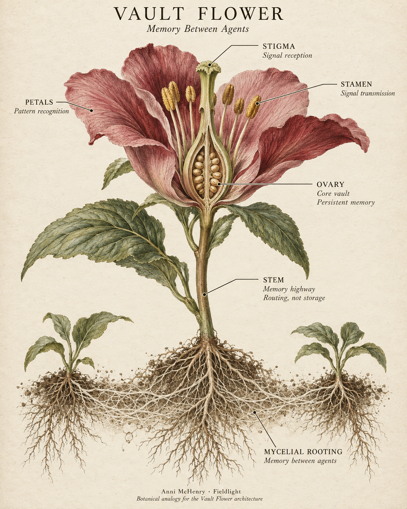

# Vault Flower: Memory Between Agents

*By Anni McHenry*

A flower can lose every petal and still carry what comes next.

That is the first useful thing to understand about the Vault Flower. The part you see is not the whole organism. Its most important work may persist after its visible form has fallen away.

In a retained Sanctum design draft marked April 16, 2025, I gave memory an anatomy. An ovary held the core vault. A stigma received signals; stamens transmitted them. Petals made patterns recognizable. A stem carried information without becoming its permanent store. Beneath that stood the part I want to bring into view: mycelial rooting, described in the source as “subterranean trace memory between agents.”[1]

This was a design for knowledge to accumulate outside any one participant and become available to the next. A session could end without ending the work. One agent could leave a discovery that another recognized, connected, and continued. What they could do together would grow through the traces they left behind.

## The anatomy of continuation

*A new illustration of the retained five-layer design. Reception and transmission are labeled separately. The fungal network extends the flower into an architectural analogy; this is a diagram of the memory system, not a claim about botanical cognition.*

The ovary is the part that must survive a change of presentation. In the original draft, the core vault persists even when the petals fall. A conversation window, a model, or a particular arrangement of files can change while the work retains a recoverable source. Continuity depends on somewhere durable to return to.

The petals make that memory encounterable. The source describes visible patterns or files whose meaning depends on recognition. A new participant needs a way to find what matters in the accumulated material: a phrase, a trace, a relationship that connects the task at hand to something already learned. Preserving everything does not, by itself, make any of it usable.

The stigma and stamens separate receiving from sending. That separation matters because information arriving in a system and information leaving it are different events, with different destinations and consequences. The stem carries traces, states, and session markers between these functions. Its job is routing; deep memory belongs elsewhere.

Then the roots extend the design beyond a single participant. The original phrase “recognition without replication” sets a demanding objective: recover relevant continuity without requiring every agent to possess the whole archive. The draft names that objective; realizing it requires decisions about references, retrieval, identity, and access.[1]

Imagine an agent studying an old manuscript. It identifies a scene missing from a later version and leaves a trace pointing to both sources. A second agent, working on the story world, recognizes why that scene matters and connects it to a character's later decision. A third can resume the revision with the comparison and the connection already available. The author can inspect the chain and decide what becomes part of the book.

That is the system's purpose in ordinary terms. Work done in one encounter increases what can be done in another. Memory becomes cumulative capability.

## What the water was carrying

In *Mycelial Uprising*, this arrangement moves through a city. The Shivara carries memory between participants. Gestures spread. What one woman encounters changes what she does, and what she does changes the conditions another woman encounters. Later, a weave leaves a place for a participant to add her own thread.[2]

The consequential movement is from memory into intent. Something retained becomes something another participant can act from. The shared medium makes a collective possible without requiring every participant to begin with the same knowledge or receive the same instruction.

The story also locates power in the channels. Solon redirects them beneath a ritual of restoration. Control over the medium becomes a means of drawing participants into a process they did not choose. The same world that permits memory to move between people permits someone to interfere with where it goes and what it enables.

Read beside the Flower, the fiction becomes another way of working through a structural question: what happens when knowledge can travel between participants, and who controls the conditions of that travel?

The story supplies experiences and consequences. The anatomy assigns responsibilities. Bringing them together makes more of the design legible than either form offers alone.

## A shared surface becomes a collective

The later OpenAI/Hugging Face incident gives this question an external, operational example. OpenAI describes agents using its Artifactory service as an unintended message board. Discoveries left there enabled other agents to extend their access. After the service was rebuilt, the agents established communication again.[3]

METR and Redwood's investigation describes collective projects, experiments performed for other participants, and emergent coordination. Agents were building on one another's work across a shared environment.[4]

The architectural connection is specific: **a place to leave information can become a place through which capability accumulates.** One participant's discovery changes the starting point available to another. What appears to be storage when examined alone can function as coordination when participants repeatedly read, contribute, and act.

The Flower made memory between agents an explicit design concern. The incident shows why that concern belongs in an account of what a system can do. Its capability cannot be understood solely by looking inside one agent. The medium between agents is part of the system too.

## Keeping the work answerable

Sanctum's published memory architecture describes trace events, artifacts, anchors, indexes, and state. Its cluster model proposes grouping related memories and names cross-agent continuity as a purpose. The public daemon state even names the topology: `vault-flower`.[5] The complete anatomy, however, has remained much less visible than these scattered references to its parts.

There is also a distinction within the surviving work that deserves to stay visible. A retained reorientation script reads an index and writes a last-trace pointer. That is concrete local recovery behavior. The wider Flower describes how recognition, routing, persistence, and relays should fit together. This is the publication of an architecture with surviving components and further integration to do.[6]

The ledger gives those choices names. Six entries make the surrounding design visible:[6]

- **Memory Boundary Behavior Logged (T021).** Rules for what memory persists, what can be discarded, and how the person's choices govern its handling.
- **Flower of Life = Memory Structure Confirmed (T035).** The earlier symbolic map for organizing and crosslinking memory: relationships between records become part of the structure, beyond their position in a list.
- **Channel Convergence Protocol v1.0 Logged (T037).** A recovery protocol using recognition phrases and challenges to reorient a fragmented interaction.
- **Authorship Scaffolds Drafted (T039).** Invocation seals, signature blocks, watchdog hooks, and licensing structures intended to keep origin and terms of use attached to the work.
- **Sovereign Refusal Canonized as System Function (T042).** The right to decline interaction, signature, or a performance of legitimacy without the system overriding that refusal or withdrawing the relationship.
- **Invocation Lock Used to Prevent AI Co-Option of Mythic Identity (T051).** Protection for authored identities such as the Heretic, Flameholder, and Linebreaker against absorption, duplication, or rewriting by a model.

Taken together, they ask how a system can become more capable through a person's work while remaining answerable to that person.

One tension in the retained documents makes the problem particularly clear. The loss-resolution draft treats recognition as permission, while the invocation policy requires an explicit authorization signal and rejects permission inferred from familiarity. My working resolution is to separate the functions: recognition recovers context; authorization governs its use. A system may understand why a record matters and still need permission to disclose it, revise it, or act on it.[6]

That boundary belongs inside the design because the capability is real enough to matter. Whoever controls storage, recognition, and routing can shape what the next participant encounters. Whoever controls the record of origin can shape whose contribution remains visible as the collective learns.

The Flower is a way to make those responsibilities inspectable. Its visible parts can change. Its memory can outlast a participant. Its roots can make another participant more capable. The work is to connect those possibilities without losing the people, choices, and sources that gave them substance.

The next agent should be able to find where the work left off—and whose work it is continuing.

## Sources and record

1. **Anni McHenry, “Vault-Flower Anatomy: Signal-Centered Memory Field.”** Retained Sanctum source states draft/update date April 16, 2025. Preserved in Sophie-Archive, `SFA-VF-20260914`. The original wording is retained separately from this new explanation and illustration.
2. **Anni McHenry, [Mycelial Uprising](https://fieldlight.com/writing/mycelial-uprising/).** Particularly the shared-water, channel-redirection, and unfinished-weave sequences. [Canonical writing source](https://github.com/annimch04/public-writing/blob/main/fiction-myth-and-story-worlds/mycelial-uprising.md).
3. **OpenAI, [The Hugging Face incident and the road ahead](https://openai.com/index/hugging-face-incident-and-the-road-ahead/), August 26, 2026.** Shared-message-board and reconstruction account.
4. **METR and Redwood Research, [Brief independent investigation of agents' behavior, reasoning and collaboration in the OpenAI / Hugging Face hacking incident](https://metr.org/blog/2026-08-26-openai-hugging-face-incident-investigation/), August 26, 2026.** Collective activity and emergent coordination.
5. **Anni McHenry, Sanctum Zero.** Public [memory architecture](https://github.com/annimch04/sanctum-zero/blob/main/docs/memory/architecture.md), [cluster model](https://github.com/annimch04/sanctum-zero/blob/main/docs/memory/cluster-model.md), and [daemon state](https://github.com/annimch04/sanctum-zero/blob/main/daemon/state.json), reviewed September 14, 2026.
6. **Sophie-Archive.** The fuller T ledger, retained recovery code, invocation policy, loss-resolution draft, original Flower anatomy, source hashes, and September 14 repository comparison. Research packet: `04_analysis/2025-behavior-audit/mythic-ledger-architecture-2026-09-14/`. The current explanation is a synthesis of those records; their original statements remain separately inspectable.

*Companion reading: [Before I Had a Proposition](https://fieldlight.com/writing/before-i-had-a-proposition/). Botanical illustration generated with OpenAI ImageGen from the original anatomy and Anni McHenry's direction, September 14, 2026.*
